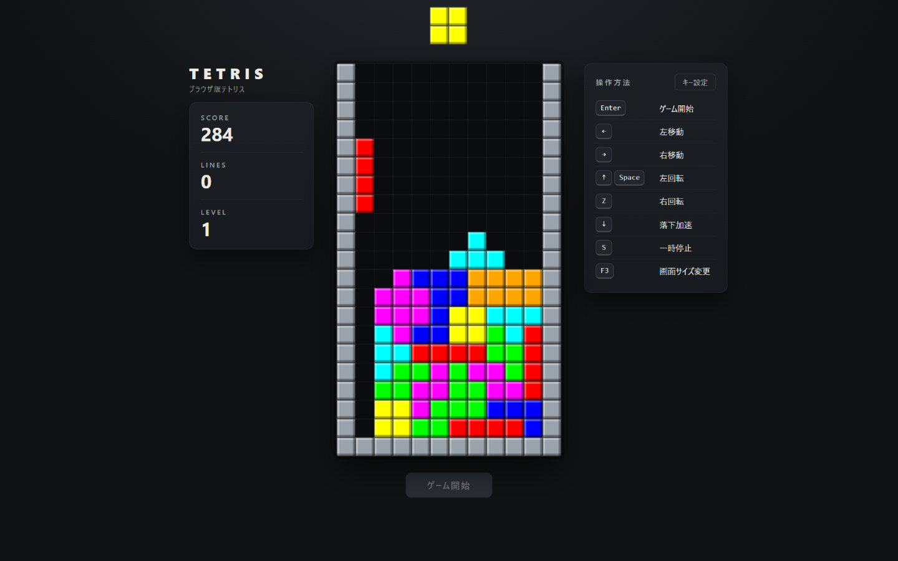

# ブラウザ版テトリス

SEGAアーケード版の操作感を意識して作った、ブラウザ版テトリスです。

HTML5 Canvas と素の JavaScript だけで動きます。ビルドや依存パッケージは不要です。



## 目次

- [作成秘話](#作成秘話)
- [特徴](#特徴)
- [起動方法](#起動方法)
- [操作方法](#操作方法)
- [キー設定（ブラウザ上でカスタマイズ）](#キー設定ブラウザ上でカスタマイズ)
- [ハイスコア](#ハイスコア)
- [ルール](#ルール)
- [設置猶予（ロックディレイ）](#設置猶予ロックディレイ)
- [SEGAアーケード版を意識したポイント](#segaアーケード版を意識したポイント)
- [開始レベル](#開始レベル)
- [画面サイズ](#画面サイズ)
- [デザイン](#デザイン)
- [効果音ファイルについて](#効果音ファイルについて)
- [ファイル構成](#ファイル構成)

## 作成秘話

作者が子どもの頃に SEGA のアーケード版テトリスにハマっていたので、思い出で作成しました。

若い頃にも何度かチャレンジしましたが満足のいくものが作れず、今回はそのリベンジです。

特に「床に接地してから弾むように回転する仕様」を実現したくて、それを実装しました。

## 特徴

- SEGAアーケード版を意識した操作感です。
- 床や壁に当たっても回しやすい、壁キック付きの回転があります。
- 着地直後に少しだけ操作できる、3段階の固定猶予（ロックディレイ）があります。
- 効果音付きでプレイできます。
- ダークアーケード風のデザインです。ブロックはベベル（面取り）による立体表現になっています。
- ライン消去時のフラッシュ演出、レベルアップ時のトースト表示など、控えめなアニメーションがあります。
- 画面の「キー設定」ボタンから、ブラウザ上でキー割り当てを変更できます（設定はブラウザに保存されます）。
- ゲームオーバー時に、名前つきでハイスコアを登録できます（上位10件をブラウザに保存）。
- `F3` で画面サイズを5段階に切り替えできます。
- URL パラメータで開始レベルを指定できます。

## 起動方法

`index.html` をブラウザで開いてください。

ローカルサーバー経由で開く場合は、たとえば次のように起動できます。

```bash
python -m http.server 8094
```

## 操作方法

初期設定のキーは次のとおりです。

| キー | 動作 |
| --- | --- |
| `Enter` | ゲーム開始 |
| `←` | 左移動 |
| `→` | 右移動 |
| `↑` または `Space` | 左回転 |
| `Z` | 右回転 |
| `↓` | ソフトドロップ |
| `S` | 一時停止 / 再開 |
| `F3` | 画面サイズ切り替え |

ゲーム画面右側の操作方法表示は、現在のキー設定に自動で追従します。

JoyToKey のようなキーマッパーを使って、ゲームパッドで遊ぶのもおすすめです。

## キー設定（ブラウザ上でカスタマイズ）

画面右側の「キー設定」ボタンから、ブラウザ上でキー割り当てを変更できます。

- キー表示をクリックして、割り当てたいキーを押すと差し替わります（`Esc` でキャンセルできます）。
- `＋` で同じ操作に複数のキー（最大3つ）を割り当てられ、`×` で個別に削除できます。
- 別の操作にすでに割り当て済みのキーは、重複して設定できません（メッセージで通知されます）。
- 設定を開くとゲームは自動的に一時停止します。設定中のキー入力はゲーム操作には影響しません。
- 変更内容はブラウザの `localStorage` に保存され、次回開いたときも引き継がれます。
- 「初期設定に戻す」ボタンで、いつでもデフォルトのキー割り当てに戻せます。

デフォルトのキーは `index.html` 先頭付近の `DEFAULT_KEY_BINDINGS` で定義しています。

- `key` は実際の入力判定に使う `KeyboardEvent.key` の値です。
- `label` はゲーム画面の操作方法に表示する文字列です。

## ハイスコア

ゲームオーバーになると、画面中央にスコア入力用のモーダルが表示されます。

- なまえを入力して「登録」（または `Enter`）を押すと、そのときのスコア・ライン数・レベルが記録されます。
- 記録はスコアの高い順に並び替えられ、上位 `10` 件だけがブラウザの `localStorage` に保持されます。
- 11位以下になった場合は登録されず、「TOP10圏外でした」と表示されます。
- 一度登録すると、同じゲームオーバー画面から二重に登録することはできません。
- なまえを空欄のまま登録すると `NONAME` として記録されます。
- 直前に入力したなまえは記憶され、次回のゲームオーバー時にもあらかじめ入力されます。
- ハイスコア一覧が見られるのはゲームオーバー画面だけです。プレイ中は表示されません。

## ルール

- 7種類のテトリミノが落ちてきます。
- 横一列がそろうとラインが消えます。
- 新しいピースの出現位置が埋まっているとゲームオーバーです。
- レベルは `4` ライン消すごとに `1` 上がります。
- レベル上限は `99` です。
- レベルが上がるほど、ピースの落下速度も上がります。
- ソフトドロップ（`↓`）は `1` マスごとに `1` 点入ります。
- ライン消去の得点は `消した本数 × 消した本数 × 100` です。
- 盤面を空にすると `5000` 点のオールクリアボーナスが入ります。

## 設置猶予（ロックディレイ）

ピースが床に着地しても、SEGAアーケード版のようにすぐには固定されません。

1. 着地した瞬間から、まず `500ms` の間は自由に操作できます（**操作可1**）。
2. この間に移動や回転などの操作をすると、猶予がさらに `200ms` 延長されます（**操作可2**）。
3. 延長後も操作をしなければ（または延長がなければ）、最後に `300ms` の「**操作不可**」時間を経てから固定されます。
4. ソフトドロップ（`↓`）で押し込んで着地させた場合は、猶予をスキップしてすぐに固定フェーズへ入ります。

固定猶予中の上方向キック（弾む回転で上にずれる動き）は、1つのピースにつき最大 `8` 回までです。

## SEGAアーケード版を意識したポイント

### ピース色

- I字: 赤
- O字: 黄色
- T字: シアン
- L字: オレンジ
- J字: 青
- S字: ライム
- Z字: フューシャ

### 回転（壁キック）

床や壁に接触している場面でも、可能な限り回転できるようにしています。

回転時に衝突する場合は、上下左右斜めの8方向のキック位置を順に試すことで、SEGAアーケード版の「弾む」感触を再現しています。

## 開始レベル

URL パラメータで開始レベルを指定できます。

```text
index.html?level=50
```

- 指定できる範囲は `1` から `99` です。
- 不正な値のときは `1` から始まります。

## 画面サイズ

開いたときの画面の高さに応じて、初期の表示サイズを自動で選びます（狭い画面では小さめに、広い画面では大きめに表示されます）。

`F3` キーで、次の5段階のサイズを順番に切り替えられます。

- `1倍` → `1.25倍` → `1.5倍` → `1.75倍` → `2倍` → （`1倍` に戻る）

## デザイン

チャコール基調のダークな配色に、琥珀（アンバー）色のアクセントを合わせたアーケード風デザインです。

- 盤面のブロックは、ミノ本来の色はそのままに、ハイライトとシャドウでベベル（立体感）を付けています。
- ライン消去時は、対象のラインが白っぽく明滅してから消えます（消去までのタイミング自体は変わりません）。
- レベルアップ時は「LEVEL UP!」のトースト表示と、レベル数値の軽いバンプアニメーションが入ります。
- スコア・ライン数が増えたときも、数値に軽いバンプアニメーションが入ります。
- ミノの配色・回転仕様・レベルアップ条件・落下速度などのゲームロジックは変更していません。見た目と演出のみの変更です。

## 効果音ファイルについて

効果音ファイルがなくても、ゲーム自体は動作します。

音があるほうが雰囲気は出るので、入れておくのがおすすめです。

## ファイル構成

```text
tetris/
├── index.html
├── README.md
├── tetris.jpg
└── sound/
    ├── clearingLines.mp3
    ├── clearingLinesEnd.mp3
    ├── gameOver.mp3
    ├── landing.mp3
    ├── levelup.mp3
    ├── pause.mp3
    ├── rotate.mp3
    ├── start.mp3
    └── unpause.mp3
```
