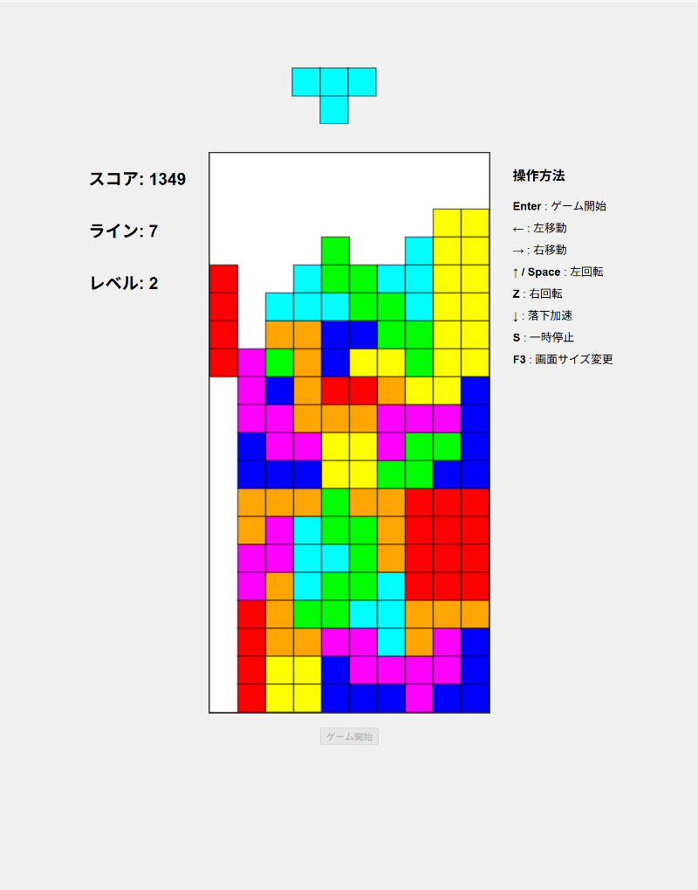

# ブラウザ版テトリス

SEGAアーケード版の操作感を意識して作った、ブラウザ版テトリスです。

HTML5 Canvas だけで動きます。



## 作成秘話

作者が子どもの頃に SEGA のアーケード版テトリスにハマっていたので、思い出で作成しました。

若い頃にも何度かチャレンジしましたが満足のいくものが作れず、今回はそのリベンジです。

特に「床に接地してから弾むように回転する仕様」を実現したくて、それを実装しました。

## 特徴

- SEGAアーケード版を意識した操作感です。
- 床や壁に当たっても回しやすい、壁キック付きの回転があります。
- 着地直後に少しだけ操作できる、固定猶予があります。
- 効果音付きでプレイできます。
- URL パラメータで開始レベルを指定できます。
- ソースコード先頭の `KEY_BINDINGS` でキー割り当てを変更できます。
- `F3` で画面サイズを切り替えできます。

## 起動方法

`index.html` をブラウザで開いてください。

## 操作方法

初期設定のキーは次のとおりです。

| キー | 動作 |
| --- | --- |
| `Enter` | ゲーム開始 |
| `←` | 左移動 |
| `→` | 右移動 |
| `↑` または `Space` | 右回転 |
| `Z` | 左回転 |
| `↓` | ソフトドロップ |
| `S` | 一時停止 / 再開 |
| `F3` | 画面サイズ切り替え |

ゲーム画面右側の操作方法表示は、現在の `KEY_BINDINGS` の内容に自動で追従します。

JoyToKey のようなキーマッパーを使って、ゲームパッドで遊ぶのもおすすめです。

## キー設定

`index.html` の先頭付近にある `KEY_BINDINGS` を書き換えると、好きなキーに差し替えられます。

- `key` は実際の入力判定に使う `KeyboardEvent.key` の値です。
- `label` はゲーム画面の操作方法に表示する文字列です。

たとえば次のように書き換えられます。

```js
rotateLeft: [{ key: 'x', label: 'X' }]
```

## ルール

- 7種類のテトリミノが落ちてきます。
- 横一列がそろうとラインが消えます。
- 新しいピースの出現位置が埋まっているとゲームオーバーです。
- レベルは `4` ライン消すごとに `1` 上がります。
- レベル上限は `99` です。
- ソフトドロップは `1` マスごとに `1` 点入ります。
- ライン消去の得点は `消した本数 × 消した本数 × 100` です。
- 盤面を空にすると `5000` 点のオールクリアボーナスが入ります。

## 開始レベル

URL パラメータで開始レベルを指定できます。

```text
index.html?level=50
```

- 指定できる範囲は `1` から `99` です。
- 不正な値のときは `1` から始まります。

## SEGAアーケード版を意識したポイント

### ピース色

- I字: 赤
- O字: 黄色
- T字: シアン
- L字: オレンジ
- J字: 青
- S字: ライム
- Z字: フューシャ

### 回転

床や壁に接触している場面でも、可能な限り回転できるようにしています。

8方向のキック位置を順に試すことで、SEGAアーケード版の「弾む」感触を意識しています。

## 効果音ファイルについて

効果音ファイルがなくても、ゲーム自体は動作します。

音があるほうが雰囲気は出るので、入れておくのがおすすめです。

## ファイル構成

```text
tetris/
├── index.html
├── README.md
├── screenshots.jpg
└── sound/
    ├── clearingLines.mp3
    ├── clearingLinesEnd.mp3
    ├── gameOver.mp3
    ├── landing.mp3
    ├── levelup.mp3
    ├── pause.mp3
    ├── rotate.mp3
    ├── start.mp3
    └── unpause.mp3
```
