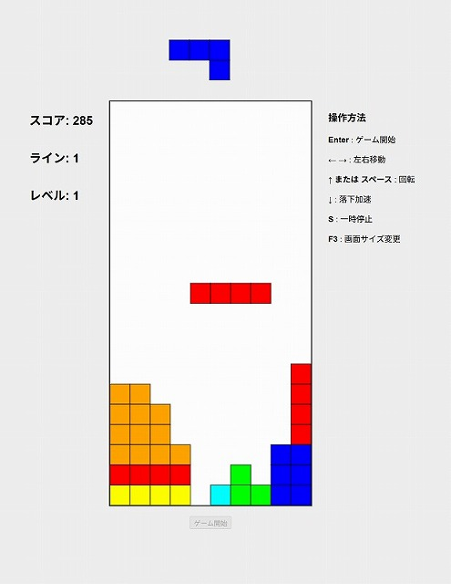

# ブラウザ版テトリス

SEGAアーケード版テトリスの操作感を真似て作成したブラウザ版テトリスゲームです。
HTML5 Canvasを使用して作成しており、懐かしのアーケード体験をブラウザで楽しめます。



## 🎯 作成秘話

作者が子どもの頃にSEGAのアーケード版テトリスにハマり、その懐かしさのあまり作成しました。
若い頃にも作成にチャレンジしましたが満足のいくものが作れず、今回はそのリベンジとして開発。
特に「床に接地してから弾むように回転する仕様」を実現したい、という思いから生まれました。

## 🎮 特徴

- **SEGAアーケード版の忠実な再現**: ピースの色配置やゲーム性を再現
- **弾む回転システム**: 床や壁に接触時の壁キック機能
- **多段階ピース固定**: 着地後の操作猶予時間システム
- **音声エフェクト**: ゲーム進行に合わせた効果音
- **レスポンシブ対応**: 画面サイズに応じた自動調整
- **カスタムレベル**: URLパラメータでの開始レベル設定

## 🎯 ゲームルール

### 基本ルール
- 上から落ちてくる7種類のテトリミノ（I, O, T, L, J, S, Z）を操作
- 横一列を完成させると消去され、上のブロックが下に落ちる
- ブロックが天井に到達するとゲームオーバー

## 🎮 操作方法

| キー | 機能 |
|------|------|
| **Enter** | ゲーム開始 |
| **←** **→** | 左右移動 |
| **↑** または **スペース** | 回転（反時計回りのみ） |
| **↓** | 高速落下（ソフトドロップ） |
| **S** | 一時停止/再開 |
| **F3** | 画面サイズ変更 |

JoyToKeyのような、ゲームパッドをキーボード・マウスに変換するエミュレーターソフトを使って
ゲームパッドを用いてのプレイをオススメします。

## 🚀 使用方法

### 基本的な起動
```
index.html をブラウザで開く
```

### カスタムレベル設定
URLパラメータで開始レベルを指定可能：
```
index.html?level=50
```
又は
```
index.html?50
```
- 指定可能範囲: 1-99

上級者は是非レベル99にチャレンジしてみてください。😋

## 📁 ファイル構成

```
tetris/
├── index.html          # メインゲームファイル
├── README.md          # このファイル（ゲームプレイには不要です）
├── screenshots.jpg    # スクリーンショットファイル（ゲームプレイには不要です）
└── sound/             # 音声ファイル（オプション）
    ├── start.mp3
    ├── landing.mp3
    ├── rotate.mp3
    ├── levelup.mp3
    ├── clearingLines.mp3
    ├── clearingLinesEnd.mp3
    ├── pause.mp3
    ├── unpause.mp3
    └── gameOver.mp3
```

## 🎵 音声ファイルについて

音声ファイルは必須ではありませんが、よりアーケード感のあるゲーム体験のために推奨されます。
音声ファイルが存在しない場合でも、ゲームは正常に動作します。

## 🎨 SEGAアーケード版を程よく再現

### ピース色配置
- I字: 赤
- O字: 黄色  
- T字: シアン
- L字: オレンジ
- J字: 青
- S字: ライム
- Z字: フューシャ

### 弾む回転
床や壁に接触時も、可能な限り回転を成功させる壁キック機能を搭載。
8方向のキック位置（左、右、上、下、左上、右上、左下、右下）を試行し、SEGAアーケード版の「弾む」回転感を再現。

## 📝 ライセンス

このプロジェクトはMITライセンスの下で公開されています。

---

**懐かしのアーケード体験をブラウザで！** 🎮